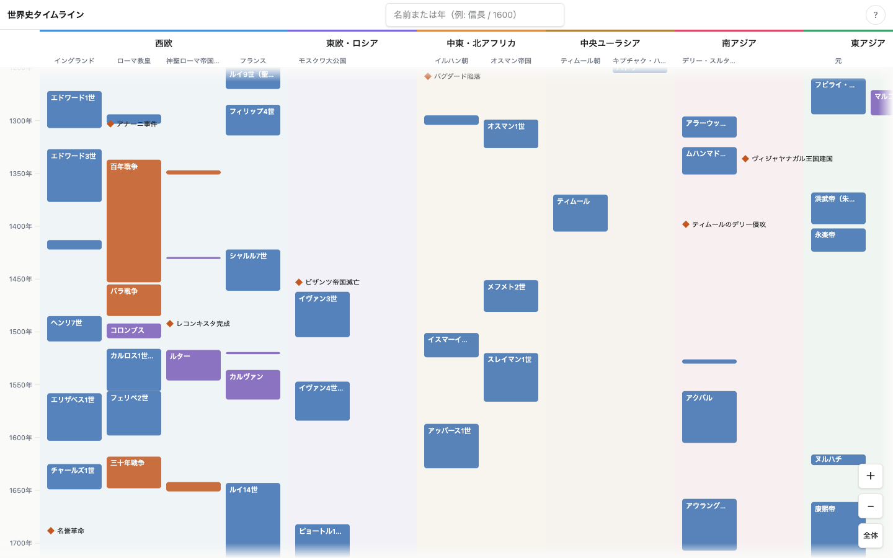

# world-history-timeline

世界史の「誰が・いつ・どこで」を一目で掴むための年表アプリ。
地域ごとのレーンが1本の縦時間軸を共有し、統治者・人物・事件の同時代性を横に見比べられる。

https://world-history-timeline.akihiro-tj.workers.dev



## 開発

```bash
pnpm install
pnpm dev
```

| コマンド | 内容 |
| --- | --- |
| `pnpm dev` | 開発サーバー |
| `pnpm test` | テスト実行 |
| `pnpm validate-data` | 年表データの検証 |
| `pnpm build` | データ検証 + 型チェック + ビルド |
| `pnpm deploy:cf` | ビルドして Cloudflare Workers にデプロイ |

## データの追加

`public/data/entries.json` にエントリを追記し、`pnpm validate-data` で検証する。
スキーマは `src/data/schema.ts`。年は整数で、紀元前は負数（前300年 → `-300`）。
設計ドキュメントは `docs/superpowers/specs/` を参照。

## デプロイ

Cloudflare Workers にアセットのみの Worker としてデプロイする。デプロイ設定は
すべて `wrangler.jsonc` にあり、main への push ごとに CI が
`cloudflare/wrangler-action` でデプロイする（GitHub Secrets に
`CLOUDFLARE_API_TOKEN` と `CLOUDFLARE_ACCOUNT_ID` が必要）。
